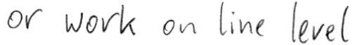

# Handwritten Text Recognition with TensorFlow

* **Update 2021/2: recognize text on line level (multiple words)**
* **Update 2021/1: more robust model, faster dataloader, word beam search decoder also available for Windows**
* **Update 2020: code is compatible with TF2**


Handwritten Text Recognition (HTR) system implemented with TensorFlow (TF) and trained on the IAM off-line HTR dataset.
The model takes **images of single words or text lines (multiple words) as input** and **outputs the recognized text**.
3/4 of the words from the validation-set are correctly recognized, and the character error rate is around 10%.


## Run demo

* Download one of the pretrained models
  * [Model trained on word images](https://www.dropbox.com/s/mya8hw6jyzqm0a3/word-model.zip?dl=1): 
    only handles single words per image, but gives better results on the IAM word dataset
  * [Model trained on text line images](https://www.dropbox.com/s/7xwkcilho10rthn/line-model.zip?dl=1):
    can handle multiple words in one image
* Put the contents of the downloaded zip-file into the `model` directory of the repository  
* Go to the `src` directory 
* Run inference code:
  * Execute `python main.py` to run the model on an image of a word
  * Execute `python main.py --img_file ../data/line.png` to run the model on an image of a text line

The input images, and the expected outputs are shown below when the text line model is used.


```
> python main.py
Init with stored values from ../model/snapshot-13
Recognized: "word"
Probability: 0.9806370139122009
```



```
> python main.py --img_file ../data/line.png
Init with stored values from ../model/snapshot-13
Recognized: "or work on line level"
Probability: 0.6674373149871826
```

## Command line arguments
* `--mode`: select between "train", "validate" and "infer". Defaults to "infer".
* `--img_file`: image that is used for inference.


## Information about model

What remains is the bare minimum to recognize text with an acceptable accuracy.
It consists of 5 CNN layers, 2 RNN (LSTM) layers and the CTC loss and decoding layer.


## References
* [Build a Handwritten Text Recognition System using TensorFlow](https://towardsdatascience.com/2326a3487cd5)
* [Scheidl - Handwritten Text Recognition in Historical Documents](https://repositum.tuwien.ac.at/obvutwhs/download/pdf/2874742)
* [Scheidl - Word Beam Search: A Connectionist Temporal Classification Decoding Algorithm](https://repositum.tuwien.ac.at/obvutwoa/download/pdf/2774578)

